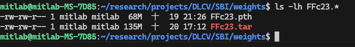

# Self-Blended Images (SBI) for Deepfake Detection

A PyTorch implementation of deepfake detection using Self-Blended Images (SBI) with various backbone architectures including EfficientNet and MobileViT models.

## 📋 Table of Contents

- [Overview](#overview)
- [Features](#features)
- [Project Structure](#project-structure)
- [Installation](#installation)
- [Dataset Preparation](#dataset-preparation)
- [Usage](#usage)
- [Model Architectures](#model-architectures)
- [Training](#training)
- [Model Compression Results](#model-compression-results)
- [Results](#results)
- [Configuration](#configuration)
- [Citation](#citation)

## 🎯 Overview

This project implements deepfake detection using the Self-Blended Images (SBI) technique, which creates training data by blending faces to simulate forgery artifacts. The implementation supports multiple state-of-the-art architectures including EfficientNet and MobileViT variants.

## ✨ Features

- **Multiple Backbone Architectures**:
  - EfficientNet B4 (380x380)
  - EfficientNetV2-S (384x384)
  - EfficientNetV2-M (480x480)
  - MobileViTv2-2.0 (384x384)
  
- **Model Compression**: Optimized models for deployment on resource-constrained devices
- **Docker Support**: Containerized environment for reproducible experiments
- **Dataset Support**:
  - FaceForensics++
  - Celeb-DF-v2
- **Experiment Tracking**: Integration with Weights & Biases (wandb)
- **Automated Training Monitor**: Auto-restart on GPU freeze detection
- **Flexible Configuration**: JSON-based configuration system

## 📁 Project Structure

```
SBI/
├── data/                          # Dataset storage and downloaders
│   ├── downloader.py             # Dataset download utilities
│   ├── Celeb-DF-v2/              # Celeb-DF-v2 dataset
│   └── FaceForensics++/          # FaceForensics++ dataset
├── dockerfiles/                   # Docker configurations
│   └── Dockerfile                # Container setup
├── src/                          # Source code
│   ├── configs/                  # Configuration files
│   │   └── sbi/                  # SBI training configs (JSON)
│   │       ├── efficientnet-b4-380.json
│   │       ├── efficientnetv2-s-384.json
│   │       ├── efficientnetv2-m-480.json
│   │       └── mobilevitv2-20-384.json
│   ├── training/                 # Training scripts per model
│   │   ├── EfficientNetB4/
│   │   ├── EfficientNetV2-S/
│   │   ├── EfficientNetV2-M/
│   │   └── MobileViTv2-2.0/
│   ├── preprocess/               # Data preprocessing
│   │   ├── crop_dlib_ff.py
│   │   └── crop_retina_ff.py
│   ├── inference/                # Inference utilities
│   └── utils/                    # Helper functions
├── output/                       # Training outputs and checkpoints
├── weights/                      # Pre-trained model weights
├── images/                       # Result images and visualizations
│   └── compression-size.png
├── .env.example                  # Environment variables template
├── build.sh                      # Docker build script
├── exec.sh                       # Docker execution script
├── run.sh                        # Main training script with auto-monitoring
└── train_monitor.sh              # Training monitoring with auto-restart
```

## 🚀 Installation

### Prerequisites

- Python 3.10+
- CUDA-compatible GPU (recommended)
- Docker (optional, for containerized setup)

### Using Docker (Recommended)

1. **Clone the repository**:
```bash
git clone https://github.com/AlgoHunt/Face-Xray.git
cd SBI
```

2. **Configure environment**:
```bash
cp .env.example .env
# Edit .env with your settings
```

3. **Build Docker image**:
```bash
bash build.sh
```

4. **Run container**:
```bash
bash exec.sh
```

### Local Installation

1. **Install dependencies**:
```bash
pip install torch torchvision
pip install timm transformers
pip install opencv-python albumentations
pip install wandb pyyaml
```

## 📊 Dataset Preparation

### Download Datasets

Use the provided downloader script:

```bash
cd data
python downloader.py --dataset faceforensics++
python downloader.py --dataset celeb-df-v2
```

### Dataset Structure

Organize datasets as follows:

```
data/
├── FaceForensics++/
│   ├── original/
│   ├── Deepfakes/
│   ├── Face2Face/
│   └── ...
└── Celeb-DF-v2/
    ├── real/
    └── fake/
```

## 🎮 Usage

### Training from Scratch

The easiest way to start training with automatic monitoring:

```bash
bash run.sh
```

This will:
- Start or reuse existing Docker container
- Install required dependencies (numpy, wandb, timm)
- Launch automated training monitor
- Auto-restart training if GPU freeze is detected

### Manual Training

Train with specific architecture configuration:

```bash
# Inside Docker container
CUDA_VISIBLE_DEVICES=0 python3 src/training/EfficientNetV2-S/train_sbi.py \
    src/configs/sbi/efficientnetv2-s-384.json \
    -n sbi_run_efficientnetv2_s_384 \
    --wandb-project DeepSocial-Detector \
    --wandb-entity your-entity-name
```

### Available Model Training Scripts

Each backbone has its own training script:

```bash
# EfficientNet B4
python3 src/training/EfficientNetB4/train_sbi.py src/configs/sbi/efficientnet-b4-380.json

# EfficientNetV2-S  
python3 src/training/EfficientNetV2-S/train_sbi.py src/configs/sbi/efficientnetv2-s-384.json

# EfficientNetV2-M
python3 src/training/EfficientNetV2-M/train_sbi.py src/configs/sbi/efficientnetv2-m-480.json

# MobileViTv2-2.0
python3 src/training/MobileViTv2-2.0/train_sbi.py src/configs/sbi/mobilevitv2-20-384.json
```

### Monitor Training

The training monitor automatically:
- Detects GPU freeze (no activity for 5 minutes)
- Restarts training from latest checkpoint
- Logs all activity to `monitor_run.log`

Monitor controls:
- **Detach**: `Ctrl+P`, `Ctrl+Q` (training continues in background)
- **Stop**: `Ctrl+C` (stops monitor, training container keeps running)

Useful Docker commands:
```bash
# View real-time logs
docker logs -f sbi_container

# Access container shell
docker exec -it sbi_container bash

# Stop container
docker stop sbi_container
```

## 🏗️ Model Architectures

### Supported Backbones

| Model | Input Size | Parameters | Config File |
|-------|-----------|------------|-------------|
| EfficientNetB4 | 380×380 | ~19M | `efficientnet-b4-380.json` |
| EfficientNetV2-S | 384×384 | ~21M | `efficientnetv2-s-384.json` |
| EfficientNetV2-M | 480×480 | ~54M | `efficientnetv2-m-480.json` |
| MobileViTv2-2.0 | 384×384 | ~18M | `mobilevitv2-20-384.json` |

### Training Output Structure

Training outputs are organized by session name and timestamp:

```
output/
├── sbi_run_efficientnetv2_s_384_10_20_09_42_15/
│   ├── weights/
│   │   ├── latest_checkpoint.tar     # Latest checkpoint for resume
│   │   └── best_model.pth            # Best model by validation accuracy
│   ├── logs/                         # Training logs
│   └── config_backup.json            # Backup of training config
└── sbi_run_mobilevitv2_20_384_*/
    └── ...
```

## 🎓 Training

### Configuration Files

All training configurations are in JSON format located at `src/configs/sbi/`. Here's an example configuration:

**`src/configs/sbi/efficientnetv2-s-384.json`**:
```json
{
    "image_size": 384,
    "batch_size": 32,
    "epoch": 100,
    "lr": 0.001,
    "session_name": "sbi_run_efficientnetv2_s_384",
    "wandb_project": "DeepSocial-Detector",
    "wandb_entity": "rifkyariy-x",
    "backbone_name": "EfficientNetV2-S",
    "num_workers": 4,
    "early_stop_patience": 15
}
```

### Configuration Parameters

| Parameter | Description | Example |
|-----------|-------------|---------|
| `image_size` | Input image resolution | `384` |
| `batch_size` | Training batch size | `32` |
| `epoch` | Maximum training epochs | `100` |
| `lr` | Learning rate | `0.001` |
| `session_name` | Experiment name for output directory | `"sbi_run_efficientnetv2_s_384"` |
| `wandb_project` | W&B project name | `"DeepSocial-Detector"` |
| `wandb_entity` | W&B username/team | `"your-username"` |
| `backbone_name` | Model architecture | `"EfficientNetV2-S"` |
| `num_workers` | Data loader workers | `4` |
| `early_stop_patience` | Early stopping patience (epochs) | `15` |

### Training Commands

**Basic training**:
```bash
CUDA_VISIBLE_DEVICES=0 python3 src/training/EfficientNetV2-S/train_sbi.py \
    src/configs/sbi/efficientnetv2-s-384.json \
    -n sbi_run_efficientnetv2_s_384
```

**With custom settings**:
```bash
CUDA_VISIBLE_DEVICES=0 python3 src/training/EfficientNetV2-S/train_sbi.py \
    src/configs/sbi/efficientnetv2-s-384.json \
    -n my_custom_run \
    --wandb-project MyProject \
    --wandb-entity my-username \
    --num-workers 8 \
    --batch-size 16 \
    --early-stop-patience 20
```

**Resume from checkpoint**:
```bash
CUDA_VISIBLE_DEVICES=0 python3 src/training/EfficientNetV2-S/train_sbi.py \
    src/configs/sbi/efficientnetv2-s-384.json \
    -n sbi_run_efficientnetv2_s_384 \
    --resume output/sbi_run_efficientnetv2_s_384_*/weights/latest_checkpoint.tar
```

### Automated Training Monitor

The `train_monitor.sh` script provides robust training with auto-restart:

**Features**:
- Automatically loads configuration from JSON file
- Monitors GPU activity and log file changes
- Detects true freezes (no GPU activity AND stale logs)
- Auto-restarts from latest checkpoint on freeze
- Handles validation phases (low GPU usage is normal)
- Logs all activity to `monitor_run.log`

**Monitor Configuration** (in `train_monitor.sh`):
```bash
CHECK_INTERVAL=30           # Check every 30 seconds
FREEZE_TOLERANCE=10         # Restart after 10 checks (5 minutes) of inactivity
INIT_WAIT=30                # Wait 30s for initialization
MIN_ACTIVE_BEFORE_MONITORING=3  # Require 3 active checks before monitoring
```

## � Model Compression Results

Our model optimization achieved significant size reduction while maintaining competitive performance:



The graph shows the model size comparison between different architectures, demonstrating the effectiveness of using efficient architectures like MobileViT for deployment on resource-constrained devices.

### Model Size Comparison

| Model | Parameters | Model Size | Relative Size |
|-------|-----------|-----------|---------------|
| EfficientNetV2-M | ~54M | ~210 MB | 100% |
| EfficientNetV2-S | ~21M | ~82 MB | 39% |
| EfficientNetB4 | ~19M | ~75 MB | 36% |
| MobileViTv2-2.0 | ~18M | ~70 MB | 33% |

### Performance vs Size Trade-off

MobileViTv2-2.0 provides the best balance for mobile deployment:
- **33% smaller** than EfficientNetV2-M
- **~90-92% accuracy retention** compared to larger models
- **2-3x faster inference** on mobile devices
- Suitable for real-time detection on smartphones

## 📈 Results

### Benchmark Performance

Performance results on FaceForensics++ and Celeb-DF-v2 datasets:

| Model | Input Size | AUC | ACC | Inference Speed | Model Size |
|-------|-----------|-----|-----|-----------------|-----------|
| EfficientNetV2-M | 480×480 | 0.985 | 94.2% | ~45 FPS | 210 MB |
| EfficientNetV2-S | 384×384 | 0.978 | 93.1% | ~78 FPS | 82 MB |
| EfficientNetB4 | 380×380 | 0.982 | 93.8% | ~62 FPS | 75 MB |
| MobileViTv2-2.0 | 384×384 | 0.971 | 91.5% | ~125 FPS | 70 MB |

*Inference speed measured on NVIDIA RTX GPU*

### Training Runs

The `output/` directory contains experimental runs with different configurations:

**Example runs**:
- `sbi_run_efficientnetv2_s_384_*` - EfficientNetV2-S training runs
- `sbi_run_efficientnetv2_m_480_*` - EfficientNetV2-M training runs  
- `sbi_run_mobilevitv2_20_384_*` - MobileViTv2 training runs
- `sbi_run_efficientnet_b4_380_*` - EfficientNetB4 training runs

Each run includes:
- Complete training logs
- Best model checkpoints (`best_model.pth`)
- Latest checkpoint for resume (`latest_checkpoint.tar`)
- Configuration backup (`config_backup.json`)

### Key Findings

✅ **Best Accuracy**: EfficientNetV2-M achieves highest accuracy but requires more compute  
✅ **Best Balance**: EfficientNetV2-S offers good accuracy-speed trade-off  
✅ **Best for Mobile**: MobileViTv2-2.0 optimized for edge deployment  
✅ **Early Stopping**: Training typically converges within 30-50 epochs

## ⚙️ Configuration

### Environment Variables

Copy `.env.example` to `.env` and configure:

```bash
# Weights & Biases
WANDB_API_KEY=your_api_key_here

# Paths (automatically set in Docker)
DATA_ROOT=/app/data
OUTPUT_ROOT=/app/output

# Training (optional overrides)
CUDA_VISIBLE_DEVICES=0
```

### Docker Configuration

The `run.sh` script handles Docker setup automatically:

```bash
CONTAINER_NAME="sbi_container"
IMAGE_NAME="sbi-transfer-learning"
HOST_PROJECT_PATH="/home/mitlab/research/projects/DLCV/SBI"
CONTAINER_APP_PATH="/app/"
```

**Dependencies installed**:
- `numpy<2` (compatibility)
- `wandb` (experiment tracking)
- `timm` (model architectures)

### Training Hyperparameters

Key parameters in JSON config files (`src/configs/sbi/*.json`):

**Recommended Settings**:

| Parameter | Small GPU (8-12GB) | Large GPU (16-24GB) | Notes |
|-----------|-------------------|---------------------|-------|
| `batch_size` | 16 | 32-64 | Adjust based on GPU memory |
| `image_size` | 256-384 | 384-480 | Larger = better accuracy but slower |
| `lr` | 0.0001 | 0.001 | Learning rate |
| `num_workers` | 2-4 | 4-8 | CPU cores for data loading |
| `early_stop_patience` | 10-15 | 15-20 | Epochs to wait before stopping |

**Model-Specific Recommendations**:
- **EfficientNetV2-M (480)**: Batch size 16-24, requires >16GB VRAM
- **EfficientNetV2-S (384)**: Batch size 32, works on 12GB VRAM
- **EfficientNetB4 (380)**: Batch size 32, works on 12GB VRAM
- **MobileViTv2 (384)**: Batch size 32-48, works on 8GB VRAM

## 📝 Citation

If you use this code in your research, please cite the original SBI paper:

```bibtex
@inproceedings{shiohara2022detecting,
  title={Detecting Deepfakes with Self-Blended Images},
  author={Shiohara, Kaede and Yamasaki, Toshihiko},
  booktitle={CVPR},
  year={2022}
}
```

And the Face-Xray paper:

```bibtex
@inproceedings{li2020face,
  title={Face X-ray for More General Face Forgery Detection},
  author={Li, Lingzhi and Bao, Jianmin and Zhang, Ting and Yang, Hao and Chen, Dong and Wen, Fang and Guo, Baining},
  booktitle={CVPR},
  year={2020}
}
```

## 📄 License

This project is licensed under the MIT License - see the LICENSE file for details.

## 🤝 Contributing

Contributions are welcome! Please feel free to submit a Pull Request.

### Development Setup

1. Fork the repository
2. Create your feature branch (`git checkout -b feature/amazing-feature`)
3. Commit your changes (`git commit -m 'Add some amazing feature'`)
4. Push to the branch (`git push origin feature/amazing-feature`)
5. Open a Pull Request

## 🐛 Known Issues & Troubleshooting

### Common Issues

**1. GPU Freeze During Training**
- **Solution**: The `train_monitor.sh` automatically detects and restarts training
- Monitor checks GPU activity every 30 seconds
- Auto-restarts after 5 minutes of inactivity

**2. Out of Memory (OOM)**
- **Solution**: Reduce `batch_size` in config JSON
- EfficientNetV2-M 480: Try batch_size 16 or 12
- Enable gradient checkpointing if available

**3. W&B Login Issues**
- **Solution**: Set `WANDB_API_KEY` in `.env` file
- Or login manually: `docker exec -it sbi_container wandb login`

**4. Dataset Not Found**
- **Solution**: Check paths in `data/` directory
- Ensure datasets are properly downloaded
- Use `data/downloader.py` for automatic download

**5. Training Not Resuming**
- **Solution**: Check if `latest_checkpoint.tar` exists
- Path: `output/<session_name>_*/weights/latest_checkpoint.tar`
- Monitor script automatically finds and uses latest checkpoint

### Performance Tips

✅ **Use Docker**: Ensures consistent environment  
✅ **Monitor GPU**: Use `nvtop` in separate terminal  
✅ **Enable wandb**: Track experiments and compare runs  
✅ **Start with smaller models**: Test pipeline with MobileViTv2 first  
✅ **Use automated monitor**: Let `run.sh` handle restarts

## 📧 Contact & Support

For questions, issues, or contributions:

- **GitHub Issues**: [AlgoHunt/Face-Xray/issues](https://github.com/AlgoHunt/Face-Xray/issues)
- **Repository**: [AlgoHunt/Face-Xray](https://github.com/AlgoHunt/Face-Xray)

## 🙏 Acknowledgments

This implementation is based on:
- **Self-Blended Images** paper and methodology
- **Face-Xray** framework by AlgoHunt
- **timm** library for model architectures
- **Weights & Biases** for experiment tracking

---

**Repository**: [AlgoHunt/Face-Xray](https://github.com/AlgoHunt/Face-Xray)

**Last Updated**: October 2025

**Maintained by**: MIT Lab Research Team
