# Inference Report — 00106.mp4

## Overview
- **Process ID:** fsbi_inference_00106.mp4_20251201_175936
- **Timestamp:** 2025-12-01T17:59:46.104179
- **Device:** cuda
- **Weights:** /app/weights/best_model.tar
- **Input Image:** /app/input/00106.mp4.jpg
- **Grad-CAM target:** fake (index 1)

## Step A — Input Image
- Dimensions: 380x380 (HxW)

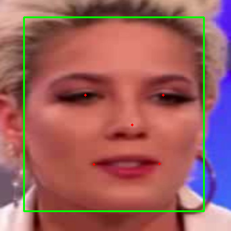

## Step B — Face Detection
- Bounding box (x0, y0, x1, y1): [39.0, 28.0, 335.0, 347.0]
- Landmarks (x, y): [[140.0, 156.0], [268.0, 156.0], [217.0, 205.0], [154.0, 270.0], [262.0, 269.0]]

## Step C — DWT Preprocessing

### Wavelet Transform (sym2, reflect mode)
- Approximation coefficients (cA) blended with original channels: (cA + original) / 2

### Before DWT (Original Face)

### After DWT (Model Input)

### DWT Statistics
- **Blended tensor:** mean 0.6878, std 0.3173, min -0.0016, max 1.5003
- **cA_r (red):** mean 0.7681, std 0.4005
- **cA_g (green):** mean 0.7267, std 0.2857
- **cA_b (blue):** mean 1.2583, std 0.3466

## Step D — Feature Journey
Layer | Shape | Activation | Heatmap
---|---|---|---
conv_stem | (1, 48, 190, 190) |  | 
bn0 | (1, 48, 190, 190) |  | 
block_00 | (1, 24, 190, 190) |  | 
block_01 | (1, 24, 190, 190) |  | 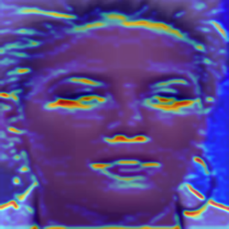
block_02 | (1, 24, 190, 190) |  | 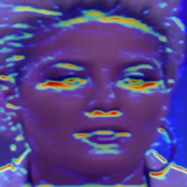
block_03 | (1, 40, 95, 95) |  | 
block_04 | (1, 40, 95, 95) | 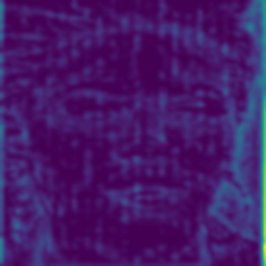 | 
block_05 | (1, 40, 95, 95) |  | 
block_06 | (1, 40, 95, 95) |  | 
block_07 | (1, 40, 95, 95) | 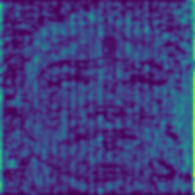 | 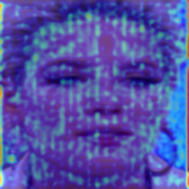
block_08 | (1, 64, 47, 47) |  | 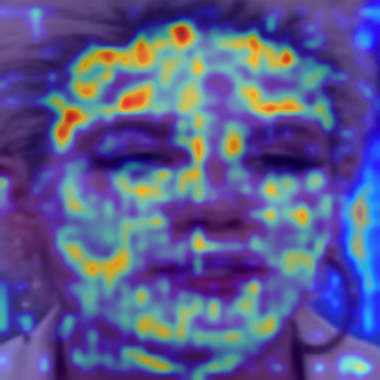
block_09 | (1, 64, 47, 47) | 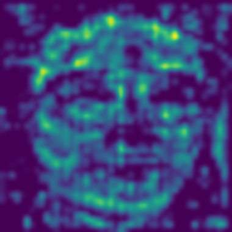 | 
block_10 | (1, 64, 47, 47) |  | 
block_11 | (1, 64, 47, 47) | 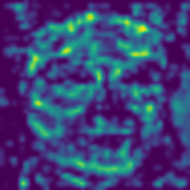 | 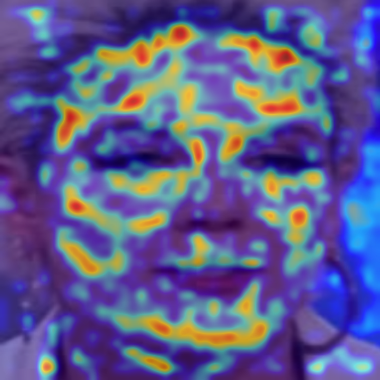
block_12 | (1, 64, 47, 47) |  | 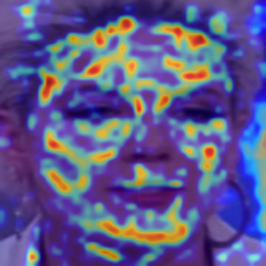
block_13 | (1, 128, 24, 24) | 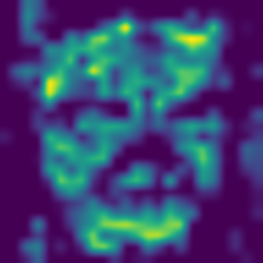 | 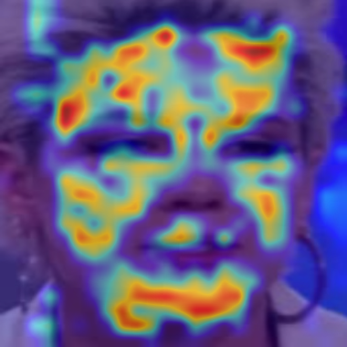
block_14 | (1, 128, 24, 24) | 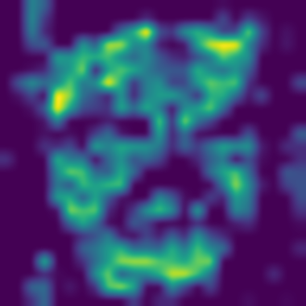 | 
block_15 | (1, 128, 24, 24) | 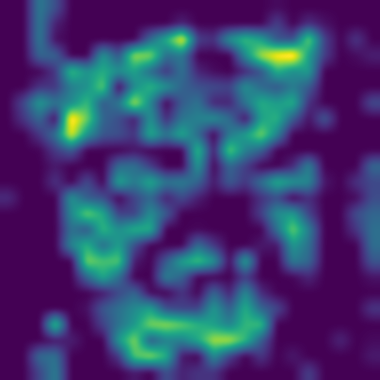 | 
block_16 | (1, 128, 24, 24) | 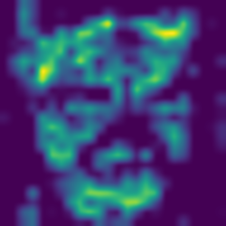 | 
block_17 | (1, 128, 24, 24) |  | 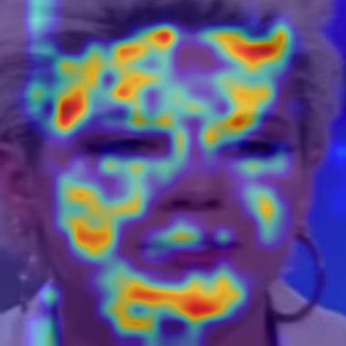
block_18 | (1, 128, 24, 24) | 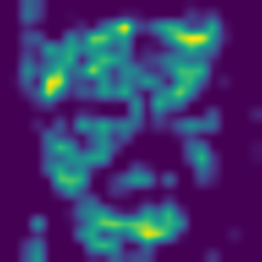 | 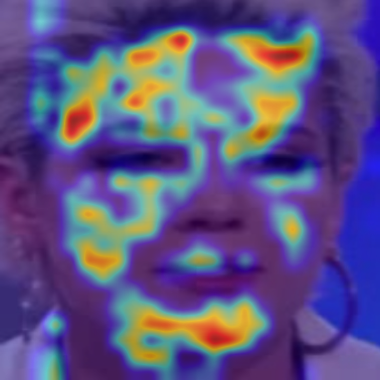
block_19 | (1, 128, 24, 24) | 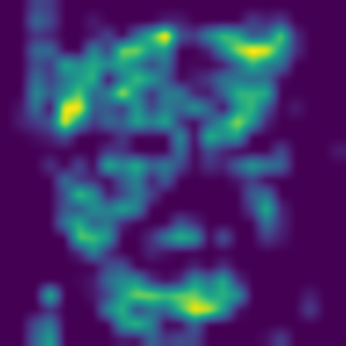 | 
block_20 | (1, 176, 24, 24) |  | 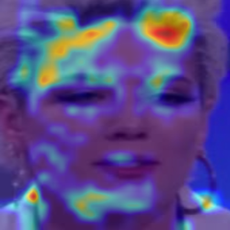
block_21 | (1, 176, 24, 24) |  | 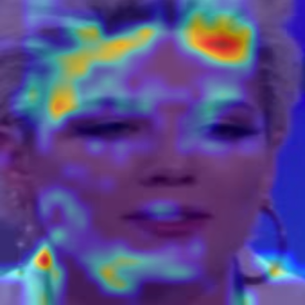
block_22 | (1, 176, 24, 24) |  | 
block_23 | (1, 176, 24, 24) | 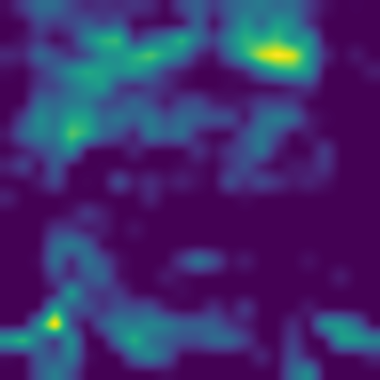 | 
block_24 | (1, 176, 24, 24) |  | 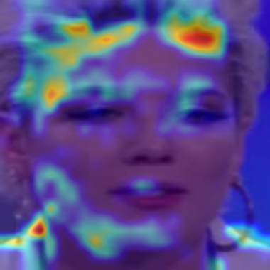
block_25 | (1, 176, 24, 24) |  | 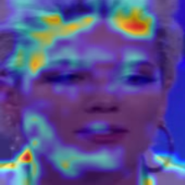
block_26 | (1, 176, 24, 24) |  | 
block_27 | (1, 304, 12, 12) |  | 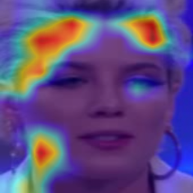
block_28 | (1, 304, 12, 12) |  | 
block_29 | (1, 304, 12, 12) |  | 
block_30 | (1, 304, 12, 12) |  | 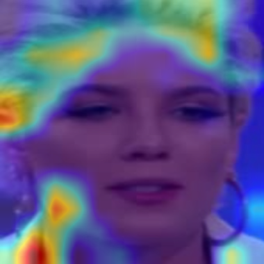
block_31 | (1, 304, 12, 12) |  | 
block_32 | (1, 304, 12, 12) | 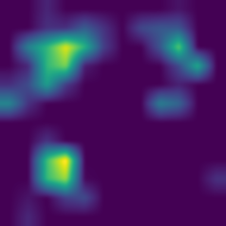 | 
block_33 | (1, 304, 12, 12) |  | 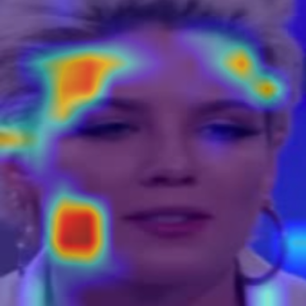
block_34 | (1, 304, 12, 12) |  | 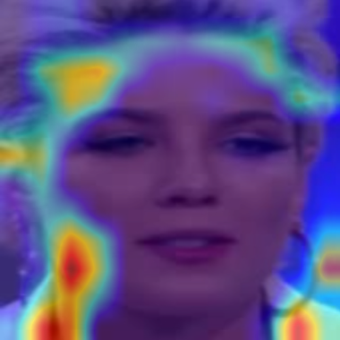
block_35 | (1, 304, 12, 12) |  | 
block_36 | (1, 512, 12, 12) |  | 
block_37 | (1, 512, 12, 12) |  | 
block_38 | (1, 512, 12, 12) |  | 
conv_head | (1, 2048, 12, 12) |  | 
bn1 | (1, 2048, 12, 12) |  | 
avg_pool | (1, 2048, 1, 1) |  | 
dropout | (1, 2048) | 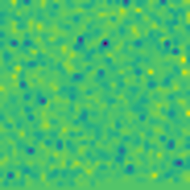 | 
fc | (1, 2) |  | 

## Step E — Classifier
- Logits: [2.6994705200195312, -2.510457992553711]
- Probabilities: [0.9945676326751709, 0.005432392004877329]
- Predicted label: **real**
- Class confidence: 0.9946