# Deepfake Analysis Report (Backbone: b5)
---
## 1. Performance Summary
| Model | Size (MB) | Reduction | AUC | Diff |
| :--- | :--- | :--- | :--- | :--- |
| **baseline** | 108.79 | -0.0% | 0.9549 (Baseline) | +0.0000 |
| **q16** | 54.60 | -49.8% | 0.9548 (Stable) | -0.0001 |
| **q16-p50** | 54.60 | -49.8% | 0.9334 (Degraded) | -0.0215 |
| **q32-p50** | 108.99 | --0.2% | 0.9332 (Degraded) | -0.0216 |
| **q8** | 27.80 | -74.4% | 0.7588 (Degraded) | -0.1960 |
| **q8-p50** | 27.80 | -74.4% | 0.7119 (Degraded) | -0.2429 |

## 2. Key Insights
- Highest AUC: **baseline** at 0.9549.
- Best compression within 1% AUC of baseline: **q16** (54.6 MB, 49.8% smaller).
- Largest AUC drop: **q8-p50** (-0.2429).

## 3. Classification Quality
| Model | Samples | TP | TN | FP | FN | Precision | Recall | F1 | Accuracy |
| :--- | ---: | ---: | ---: | ---: | ---: | ---: | ---: | ---: | ---: |
| **baseline** | 518 | 292 | 163 | 15 | 48 | 0.951 | 0.859 | 0.903 | 0.878 |
| **q16** | 518 | 291 | 163 | 15 | 49 | 0.951 | 0.856 | 0.901 | 0.876 |
| **q16-p50** | 518 | 339 | 50 | 128 | 1 | 0.726 | 0.997 | 0.840 | 0.751 |
| **q32-p50** | 518 | 339 | 49 | 129 | 1 | 0.724 | 0.997 | 0.839 | 0.749 |
| **q8** | 518 | 339 | 2 | 176 | 1 | 0.658 | 0.997 | 0.793 | 0.658 |
| **q8-p50** | 518 | 340 | 0 | 178 | 0 | 0.656 | 1.000 | 0.793 | 0.656 |

## 4. Visualizations
| Size vs AUC | ROC Curve |
| :---: | :---: |
| 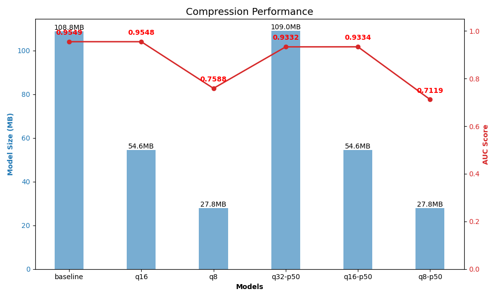 | 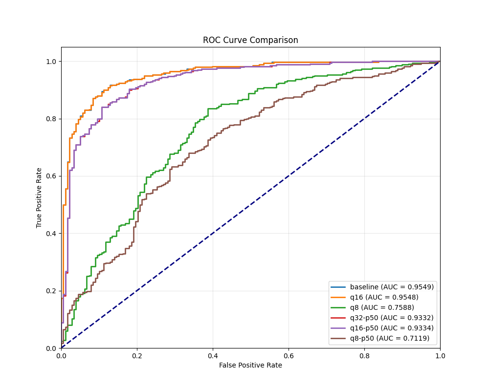 |

## 5. Visual Analysis
### Resolved Fakes (True Positives)

| Model | Rank 1 | Rank 2 | Rank 3 | Rank 4 | Rank 5 |
| :--- | :---: | :---: | :---: | :---: | :---: |
| **Baseline** | 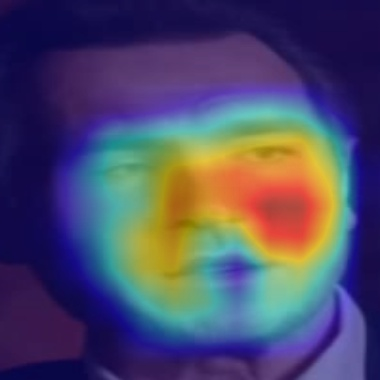 `0.9999` _id37_id3_0.._ |  `0.9999` _id46_id41_.._ |  `0.9999` _id43_id40_.._ |  `0.9999` _id1_id2_00.._ |  `0.9998` _id17_id16_.._ |
| **q16** |  `0.9999` _id37_id3_0.._ |  `0.9999` _id46_id41_.._ |  `0.9999` _id43_id40_.._ | 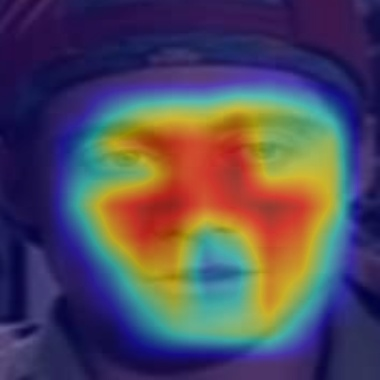 `0.9999` _id1_id2_00.._ | 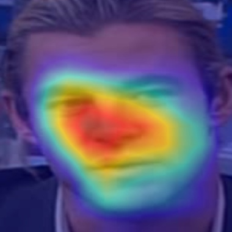 `0.9998` _id17_id16_.._ |
| **q16-p50** | 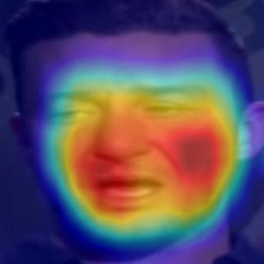 `0.9986` _id35_id31_.._ |  `0.9982` _id37_id28_.._ | 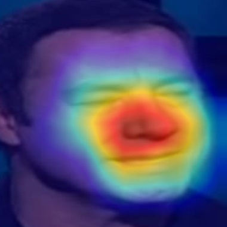 `0.9981` _id21_id20_.._ |  `0.9980` _id39_id44_.._ |  `0.9980` _id28_id6_0.._ |
| **q32-p50** |  `0.9986` _id35_id31_.._ | 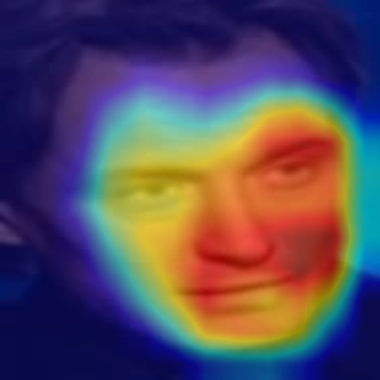 `0.9982` _id37_id28_.._ |  `0.9981` _id21_id20_.._ |  `0.9981` _id39_id44_.._ |  `0.9980` _id28_id6_0.._ |
| **q8** |  `1.0000` _id46_id41_.._ | 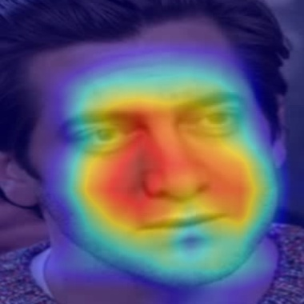 `1.0000` _id2_id0_00.._ |  `1.0000` _id1_id2_00.._ | 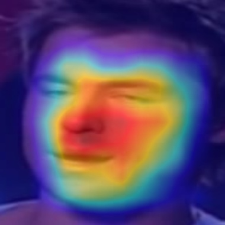 `0.9999` _id1_id3_00.._ | 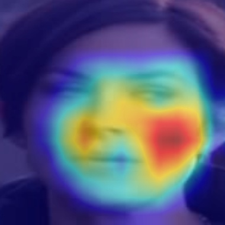 `0.9999` _id57_id53_.._ |
| **q8-p50** | 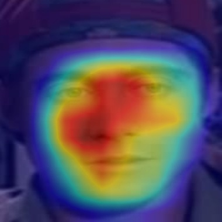 `0.9998` _id1_id2_00.._ |  `0.9995` _id17_id2_0.._ | 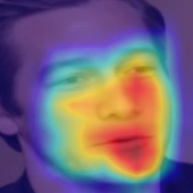 `0.9994` _id2_id26_0.._ |  `0.9993` _id24_id20_.._ | 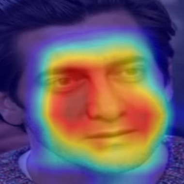 `0.9993` _id2_id0_00.._ |

### Missed Fakes (False Negatives)

| Model | Rank 1 | Rank 2 | Rank 3 | Rank 4 | Rank 5 |
| :--- | :---: | :---: | :---: | :---: | :---: |
| **Baseline** |  `0.0304` _id29_id32_.._ |  `0.1034` _id30_id6_0.._ |  `0.1215` _id33_id32_.._ | 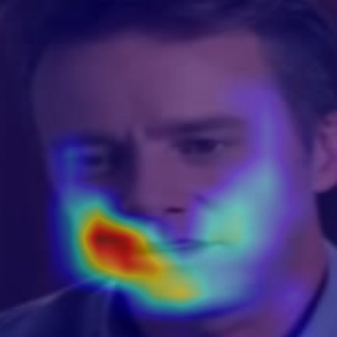 `0.1218` _id30_id23_.._ |  `0.1294` _id9_id3_00.._ |
| **q16** |  `0.0301` _id29_id32_.._ |  `0.1025` _id30_id6_0.._ |  `0.1206` _id33_id32_.._ | 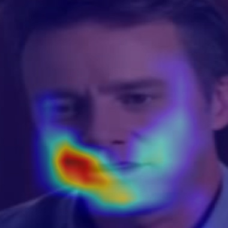 `0.1208` _id30_id23_.._ |  `0.1291` _id9_id3_00.._ |
| **q16-p50** | 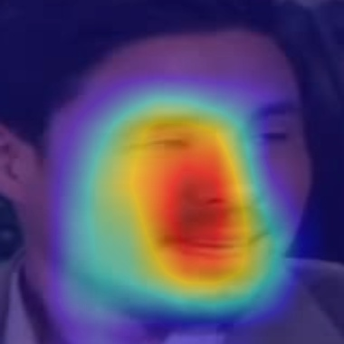 `0.3961` _id9_id3_00.._ | N/A | N/A | N/A | N/A |
| **q32-p50** |  `0.3973` _id9_id3_00.._ | N/A | N/A | N/A | N/A |
| **q8** |  `0.3872` _id10_id11_.._ | N/A | N/A | N/A | N/A |
| **q8-p50** | N/A | N/A | N/A | N/A | N/A |

### False Positives (Real labeled Fake)

| Model | Rank 1 | Rank 2 | Rank 3 | Rank 4 | Rank 5 |
| :--- | :---: | :---: | :---: | :---: | :---: |
| **Baseline** |  `0.9808` _00047.mp4_ |  `0.8435` _id51_0001..._ |  `0.8011` _00170.mp4_ | 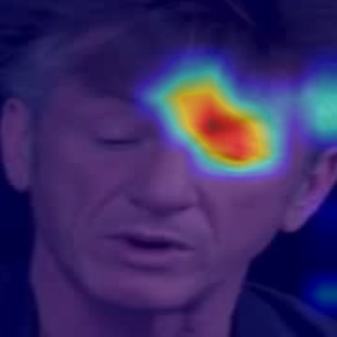 `0.7185` _id31_0003..._ |  `0.6559` _id21_0009..._ |
| **q16** | 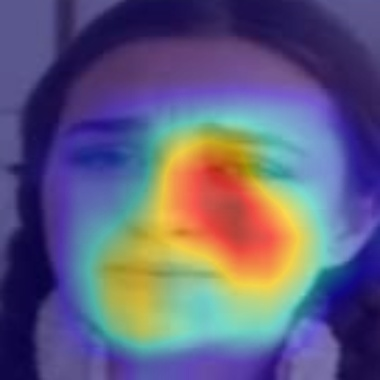 `0.9809` _00047.mp4_ |  `0.8418` _id51_0001..._ |  `0.8003` _00170.mp4_ |  `0.7177` _id31_0003..._ | 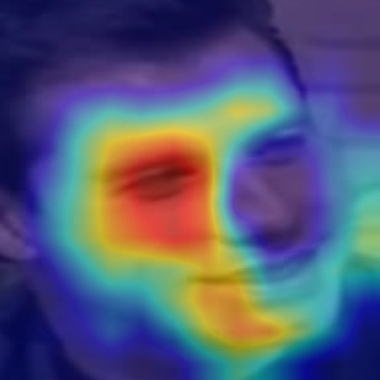 `0.6526` _id21_0009..._ |
| **q16-p50** |  `0.9966` _00047.mp4_ |  `0.9955` _id51_0001..._ |  `0.9936` _00082.mp4_ | 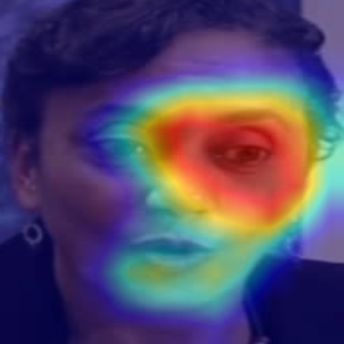 `0.9876` _00256.mp4_ | 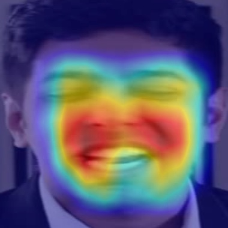 `0.9728` _00264.mp4_ |
| **q32-p50** |  `0.9966` _00047.mp4_ |  `0.9955` _id51_0001..._ |  `0.9937` _00082.mp4_ |  `0.9878` _00256.mp4_ |  `0.9734` _00264.mp4_ |
| **q8** | 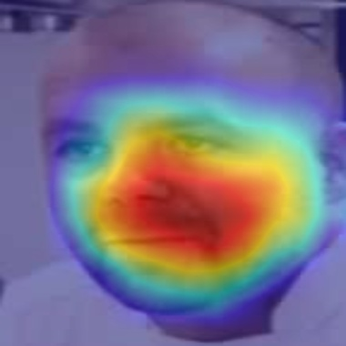 `0.9999` _00119.mp4_ | 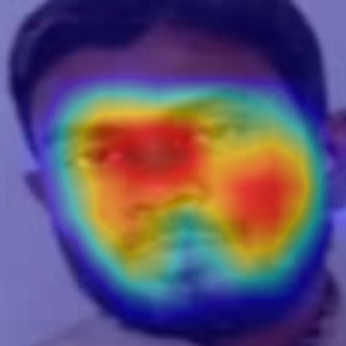 `0.9999` _00236.mp4_ | 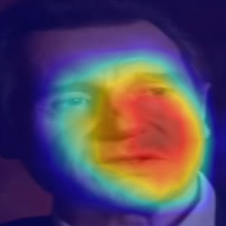 `0.9999` _id37_0004..._ | 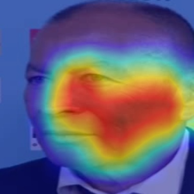 `0.9998` _00252.mp4_ | 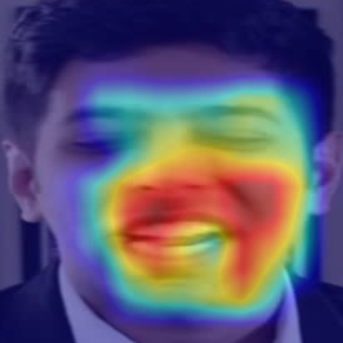 `0.9998` _00264.mp4_ |
| **q8-p50** | 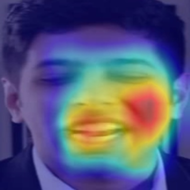 `0.9993` _00264.mp4_ | 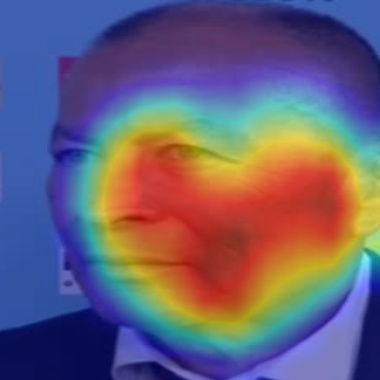 `0.9989` _00252.mp4_ | 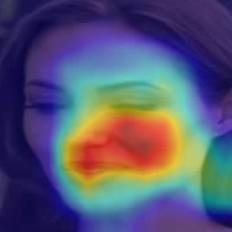 `0.9987` _id13_0011..._ |  `0.9984` _00256.mp4_ | 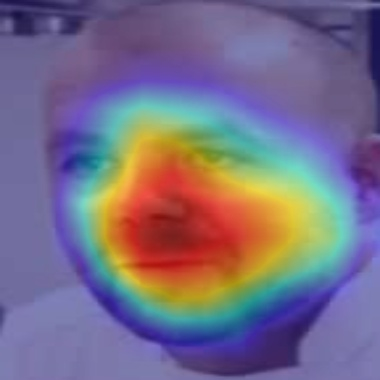 `0.9984` _00119.mp4_ |

### Confirmed Reals (True Negatives)

| Model | Rank 1 | Rank 2 | Rank 3 | Rank 4 | Rank 5 |
| :--- | :---: | :---: | :---: | :---: | :---: |
| **Baseline** |  `0.0020` _id32_0008..._ |  `0.0026` _id27_0009..._ |  `0.0027` _id4_0004.mp4_ |  `0.0033` _id36_0008..._ |  `0.0035` _id44_0003..._ |
| **q16** |  `0.0020` _id32_0008..._ |  `0.0026` _id27_0009..._ |  `0.0027` _id4_0004.mp4_ |  `0.0033` _id36_0008..._ |  `0.0035` _id44_0003..._ |
| **q16-p50** |  `0.0321` _id32_0008..._ |  `0.0702` _id36_0008..._ |  `0.0847` _id27_0009..._ |  `0.0956` _id35_0003..._ |  `0.1100` _id36_0000..._ |
| **q32-p50** |  `0.0323` _id32_0008..._ |  `0.0704` _id36_0008..._ |  `0.0851` _id27_0009..._ | 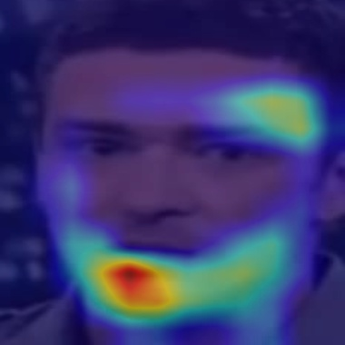 `0.0965` _id35_0003..._ |  `0.1107` _id36_0000..._ |
| **q8** |  `0.3014` _00207.mp4_ | 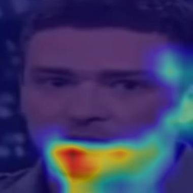 `0.3667` _id35_0003..._ | N/A | N/A | N/A |
| **q8-p50** | N/A | N/A | N/A | N/A | N/A |
