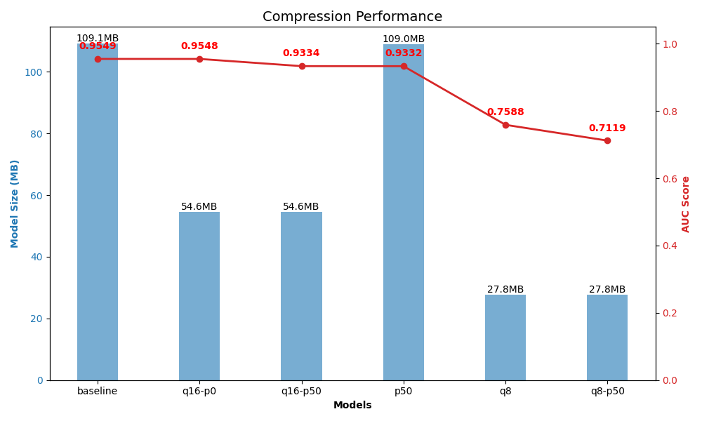
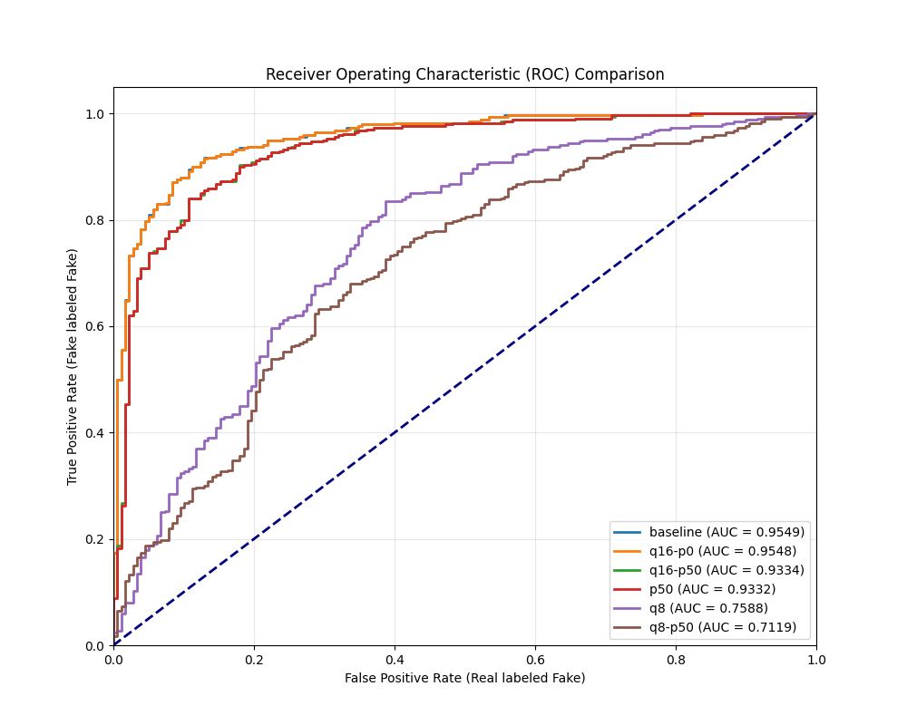
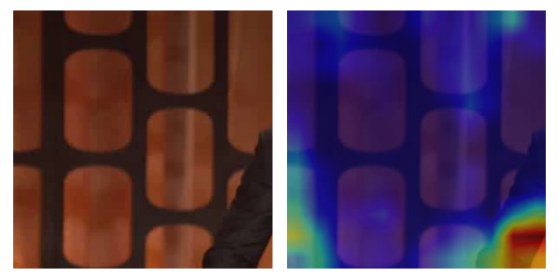

# Deepfake Model Analysis Report
**Backbone:** EfficientNet-b5 | **Base Size:** 109.07 MB
---
## 1. Performance Summary
| Model | Size (MB) | Reduction | AUC | Diff |
| :--- | :--- | :--- | :--- | :--- |
| **baseline** | 109.07 | -0.0% | 0.9549 ⚪ | +0.0000 |
| **Comp-p50** | 108.99 | -0.1% | 0.9332 🔴 | -0.0216 |
| **Comp-q16-p0** | 54.60 | -49.9% | 0.9548 🟢 | -0.0001 |
| **Comp-q16-p50** | 54.60 | -49.9% | 0.9334 🔴 | -0.0215 |
| **Comp-q8** | 27.80 | -74.5% | 0.7588 🔴 | -0.1960 |
| **Comp-q8-p50** | 27.80 | -74.5% | 0.7119 🔴 | -0.2429 |

## 2. Visualizations
| Size vs AUC | ROC Curve |
| :---: | :---: |
|  |  |

## 3. Visual Analysis (Heatmaps)
Comparison of model attention on resolved (correct) and unresolved (missed) fakes.
### Resolved Heatmaps (Top 5)

| Model | Rank 1 | Rank 2 | Rank 3 | Rank 4 | Rank 5 |
| :--- | :---: | :---: | :---: | :---: | :---: |
| **Baseline** |  `0.9999` _id37_id3_000.._ |  `0.9999` _id46_id41_00.._ |  `0.9999` _id43_id40_00.._ |  `0.9999` _id1_id2_0007.._ |  `0.9998` _id17_id16_00.._ |
| **Comp-p50** |  `0.9986` _id35_id31_00.._ |  `0.9982` _id37_id28_00.._ |  `0.9981` _id21_id20_00.._ |  `0.9981` _id39_id44_00.._ |  `0.9980` _id28_id6_000.._ |
| **Comp-q16-p0** |  `0.9999` _id37_id3_000.._ |  `0.9999` _id46_id41_00.._ |  `0.9999` _id43_id40_00.._ |  `0.9999` _id1_id2_0007.._ |  `0.9998` _id17_id16_00.._ |
| **Comp-q16-p50** |  `0.9986` _id35_id31_00.._ |  `0.9982` _id37_id28_00.._ |  `0.9981` _id21_id20_00.._ |  `0.9980` _id39_id44_00.._ |  `0.9980` _id28_id6_000.._ |
| **Comp-q8** |  `1.0000` _id46_id41_00.._ |  `1.0000` _id2_id0_0008.._ |  `1.0000` _id1_id2_0002.._ |  `0.9999` _id1_id3_0003.._ |  `0.9999` _id57_id53_00.._ |
| **Comp-q8-p50** |  `0.9998` _id1_id2_0007.._ |  `0.9995` _id17_id2_000.._ |  `0.9994` _id2_id26_000.._ |  `0.9993` _id24_id20_00.._ |  `0.9993` _id2_id0_0008.._ |

 
### Unresolved Heatmaps (Top 5)

| Model | Rank 1 | Rank 2 | Rank 3 | Rank 4 | Rank 5 |
| :--- | :---: | :---: | :---: | :---: | :---: |
| **Baseline** |  `0.2413` _id21_id19_00.._ |  `0.2252` _id38_id34_00.._ |  `0.2219` _id4_id6_0008.._ |  `0.2019` _id34_id32_00.._ |  `0.1330` _id13_id7_000.._ |
| **Comp-p50** |  `0.7619` _id31_id16_00.._ |  `0.7375` _id34_id32_00.._ |  `0.6920` _id30_id23_00.._ |  `0.6804` _id30_id6_000.._ |  `0.6515` _id29_id37_00.._ |
| **Comp-q16-p0** |  `0.2383` _id21_id19_00.._ |  `0.2238` _id38_id34_00.._ |  `0.2188` _id4_id6_0008.._ |  `0.1995` _id34_id32_00.._ |  `0.1321` _id13_id7_000.._ |
| **Comp-q16-p50** |  `0.7611` _id31_id16_00.._ |  `0.7342` _id34_id32_00.._ |  `0.6907` _id30_id23_00.._ |  `0.6784` _id30_id6_000.._ |  `0.6508` _id29_id37_00.._ |
| **Comp-q8** |  `0.8662` _id7_id11_000.._ |  `0.8490` _id4_id6_0002.._ |  `0.8249` _id38_id33_00.._ |  `0.8208` _id0_id21_000.._ |  `0.8090` _id28_id4_000.._ |
| **Comp-q8-p50** |  `0.9288` _id27_id25_00.._ |  `0.9201` _id28_id4_000.._ |  `0.9162` _id32_id33_00.._ |  `0.9144` _id38_id33_00.._ |  `0.9093` _id0_id1_0000.._ |

### 🚨 Worst Mismatches (Error Analysis)

These are the samples causing the biggest drop in ROC.

#### Top 5 False Positives (Real Videos labeled as Fake)
| Rank | baseline | p50 | q16-p0 | q16-p50 | q8 | q8-p50 |
| :--- | :---: | :---: | :---: | :---: | :---: | :---: |
| #1 | **0.9808** `00047.mp4` | **0.9966** `00047.mp4` | **0.9809** `00047.mp4` | **0.9966** `00047.mp4` | **0.9999** `00119.mp4` | **0.9993** `00264.mp4` |
| #2 | **0.8435** `id51_0001.mp4` | **0.9955** `id51_0001.mp4` | **0.8418** `id51_0001.mp4` | **0.9955** `id51_0001.mp4` | **0.9999** `00236.mp4` | **0.9989** `00252.mp4` |
| #3 | **0.8011** `00170.mp4` | **0.9937** `00082.mp4` | **0.8003** `00170.mp4` | **0.9936** `00082.mp4` | **0.9999** `id37_0004.mp4` | **0.9987** `id13_0011.mp4` |
| #4 | **0.7185** `id31_0003.mp4` | **0.9878** `00256.mp4` | **0.7177** `id31_0003.mp4` | **0.9876** `00256.mp4` | **0.9998** `00252.mp4` | **0.9984** `00256.mp4` |
| #5 | **0.6559** `id21_0009.mp4` | **0.9734** `00264.mp4` | **0.6526** `id21_0009.mp4` | **0.9728** `00264.mp4` | **0.9998** `00264.mp4` | **0.9984** `00119.mp4` |

#### Top 5 False Negatives (Fake Videos labeled as Real)
| Rank | baseline | p50 | q16-p0 | q16-p50 | q8 | q8-p50 |
| :--- | :---: | :---: | :---: | :---: | :---: | :---: |
| #1 | **0.0304** `id29_id32_0000.mp4` | **0.3973** `id9_id3_0009.mp4` | **0.0301** `id29_id32_0000.mp4` | **0.3961** `id9_id3_0009.mp4` | **0.3872** `id10_id11_0001.mp4` | **0.7264** `id29_id37_0005.mp4` |
| #2 | **0.1034** `id30_id6_0007.mp4` | **0.5185** `id29_id32_0000.mp4` | **0.1025** `id30_id6_0007.mp4` | **0.5147** `id29_id32_0000.mp4` | **0.6605** `id29_id37_0005.mp4` | **0.8066** `id10_id11_0001.mp4` |
| #3 | **0.1215** `id33_id32_0006.mp4` | **0.5206** `id33_id32_0006.mp4` | **0.1206** `id33_id32_0006.mp4` | **0.5180** `id33_id32_0006.mp4` | **0.7418** `id49_id52_0007.mp4` | **0.8699** `id0_id21_0000.mp4` |
| #4 | **0.1218** `id30_id23_0007.mp4` | **0.5713** `id38_id34_0004.mp4` | **0.1208** `id30_id23_0007.mp4` | **0.5695** `id38_id34_0004.mp4` | **0.7617** `id10_id13_0001.mp4` | **0.9067** `id17_id28_0001.mp4` |
| #5 | **0.1294** `id9_id3_0009.mp4` | **0.6394** `id16_id6_0001.mp4` | **0.1291** `id9_id3_0009.mp4` | **0.6378** `id16_id6_0001.mp4` | **0.7899** `id0_id1_0000.mp4` | **0.9071** `id13_id7_0012.mp4` |
