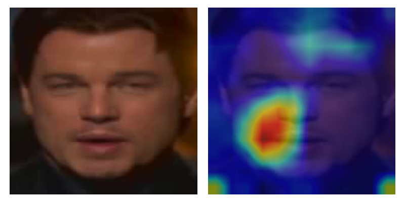
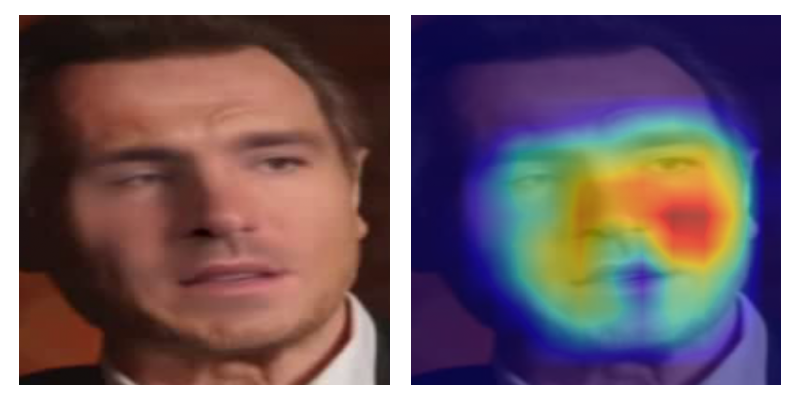
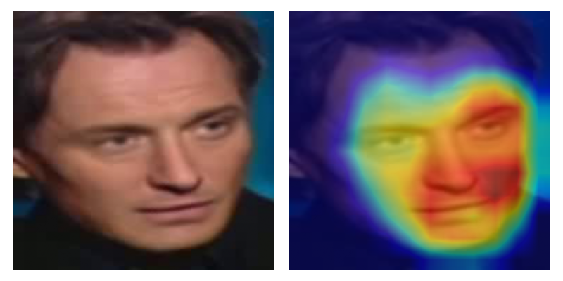
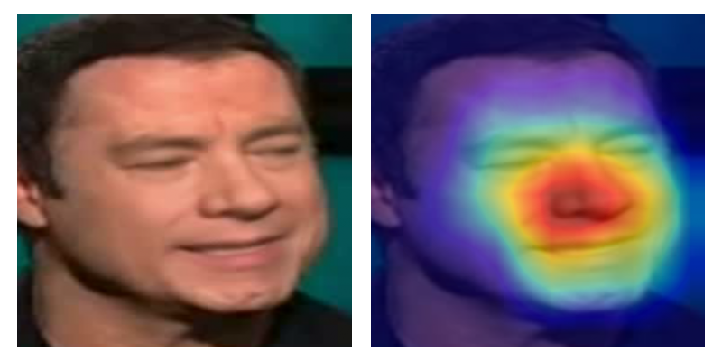
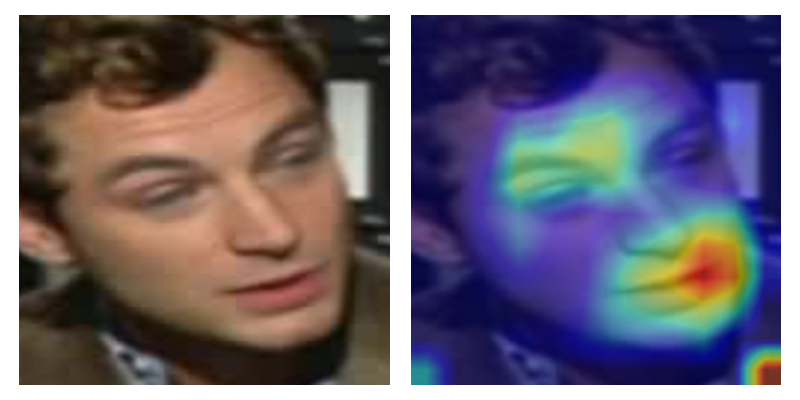

# Deepfake Compression Report

## Configuration
* **Backbone:** b5

## Performance Table
| Model | AUC | Size (MB) | 
| :--- | :--- | :--- | 
| Baseline | 0.9549 | 108.79 |
| compressed_q16-p0 | 0.9548 | 54.60 |
| compressed_q16-p50 | 0.9334 | 54.60 |
| compressed_p50 | 0.9332 | 108.99 |
| compressed_q8 | 0.7588 | 27.80 |
| compressed_q8-p50 | 0.7119 | 27.80 |

## Analysis
Detailed heatmaps for resolved and unresolved samples. **Note:** Image paths are relative to the `results` folder.

### 🔹 Model: BASELINE
| Rank | ✅ Top Resolved (Detected Fake) | ❌ Top Unresolved (Missed Fake) |
| :---: | :--- | :--- |
| #1 |  **Score:** 0.9999 `id37_id3_0004.mp4` |  **Score:** 0.2413 `id21_id19_0005.mp4` |
| #2 |  **Score:** 0.9999 `id46_id41_0000.mp4` |  **Score:** 0.2252 `id38_id34_0004.mp4` |
| #3 |  **Score:** 0.9999 `id43_id40_0005.mp4` |  **Score:** 0.2219 `id4_id6_0008.mp4` |

---
### 🔹 Model: COMPRESSED Q16-P0
| Rank | ✅ Top Resolved (Detected Fake) | ❌ Top Unresolved (Missed Fake) |
| :---: | :--- | :--- |
| #1 |  **Score:** 0.9999 `id37_id3_0004.mp4` |  **Score:** 0.2383 `id21_id19_0005.mp4` |
| #2 |  **Score:** 0.9999 `id46_id41_0000.mp4` |  **Score:** 0.2238 `id38_id34_0004.mp4` |
| #3 |  **Score:** 0.9999 `id43_id40_0005.mp4` |  **Score:** 0.2188 `id4_id6_0008.mp4` |

---
### 🔹 Model: COMPRESSED Q16-P50
| Rank | ✅ Top Resolved (Detected Fake) | ❌ Top Unresolved (Missed Fake) |
| :---: | :--- | :--- |
| #1 |  **Score:** 0.9986 `id35_id31_0006.mp4` |  **Score:** 0.7611 `id31_id16_0002.mp4` |
| #2 |  **Score:** 0.9982 `id37_id28_0007.mp4` |  **Score:** 0.7342 `id34_id32_0007.mp4` |
| #3 |  **Score:** 0.9981 `id21_id20_0006.mp4` |  **Score:** 0.6907 `id30_id23_0007.mp4` |

---
### 🔹 Model: COMPRESSED P50
| Rank | ✅ Top Resolved (Detected Fake) | ❌ Top Unresolved (Missed Fake) |
| :---: | :--- | :--- |
| #1 |  **Score:** 0.9986 `id35_id31_0006.mp4` |  **Score:** 0.7619 `id31_id16_0002.mp4` |
| #2 |  **Score:** 0.9982 `id37_id28_0007.mp4` |  **Score:** 0.7375 `id34_id32_0007.mp4` |
| #3 |  **Score:** 0.9981 `id21_id20_0006.mp4` |  **Score:** 0.6920 `id30_id23_0007.mp4` |

---
### 🔹 Model: COMPRESSED Q8
| Rank | ✅ Top Resolved (Detected Fake) | ❌ Top Unresolved (Missed Fake) |
| :---: | :--- | :--- |
| #1 |  **Score:** 1.0000 `id46_id41_0000.mp4` |  **Score:** 0.8662 `id7_id11_0007.mp4` |
| #2 |  **Score:** 1.0000 `id2_id0_0008.mp4` |  **Score:** 0.8490 `id4_id6_0002.mp4` |
| #3 |  **Score:** 1.0000 `id1_id2_0002.mp4` |  **Score:** 0.8249 `id38_id33_0005.mp4` |

---
### 🔹 Model: COMPRESSED Q8-P50
| Rank | ✅ Top Resolved (Detected Fake) | ❌ Top Unresolved (Missed Fake) |
| :---: | :--- | :--- |
| #1 |  **Score:** 0.9998 `id1_id2_0007.mp4` |  **Score:** 0.9288 `id27_id25_0008.mp4` |
| #2 |  **Score:** 0.9995 `id17_id2_0000.mp4` |  **Score:** 0.9201 `id28_id4_0006.mp4` |
| #3 |  **Score:** 0.9994 `id2_id26_0001.mp4` |  **Score:** 0.9162 `id32_id33_0002.mp4` |

---
